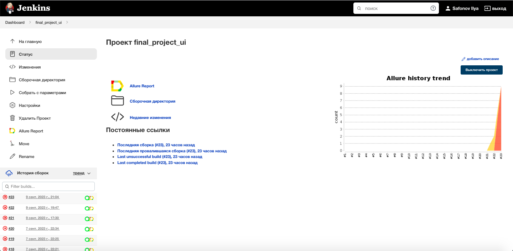
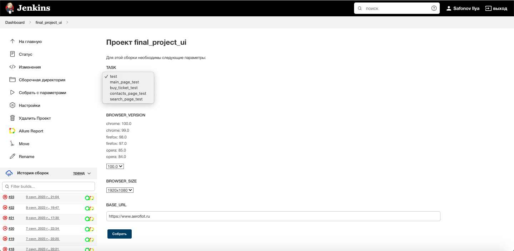
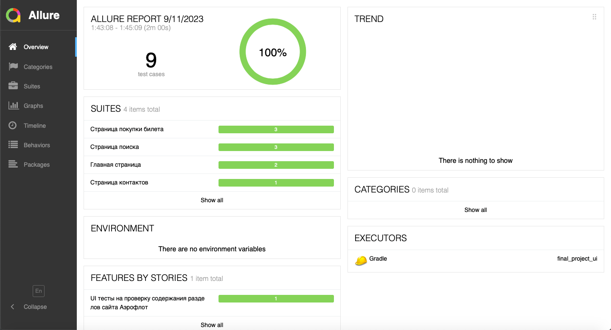
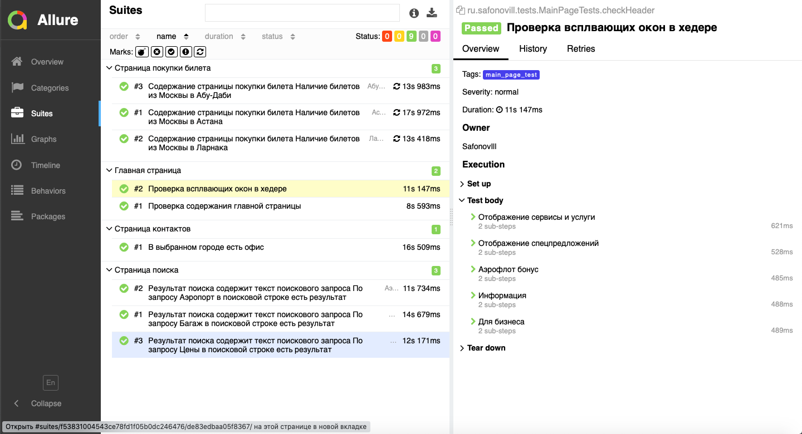
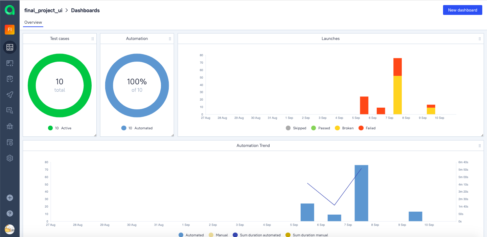
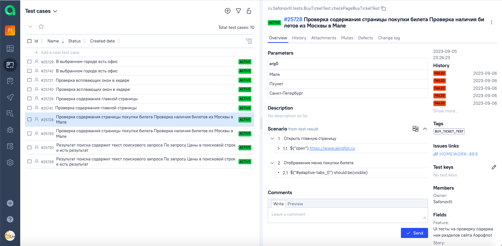
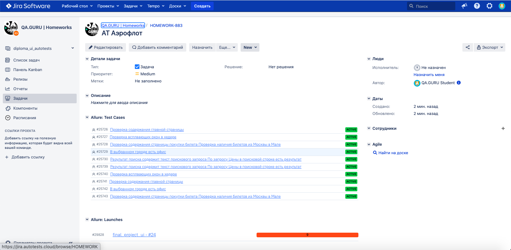
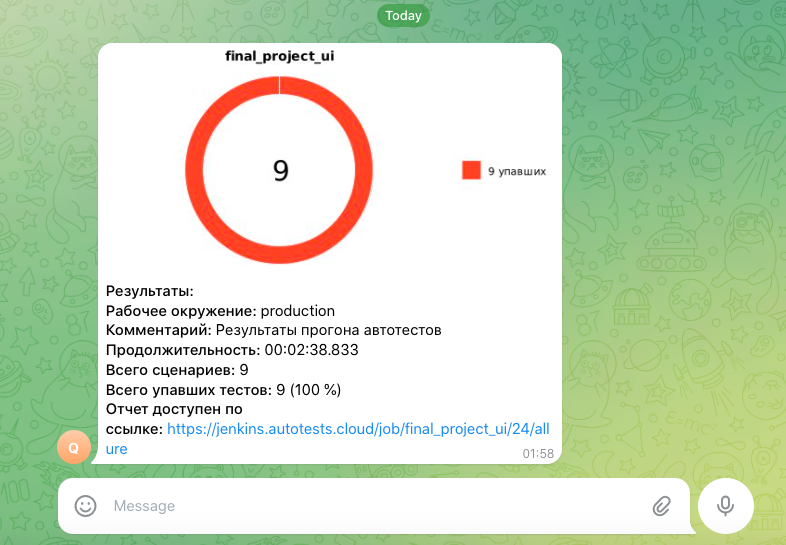

<h1 >Проект автоматизации тестирования UI для сайта <a href="https://aeroflot.ru/ ">AEROFLOT </a> :airplane: </h1> 


 
## :books: Содержание

* <a href="#tools">Технологии и инструменты</a>

* <a href="#cases">Реализованные проверки</a>

* <a href="#console">Запуск тестов из терминала</a>

* <a href="#jenkins">Запуск тестов в Jenkins</a>

* <a href="#allure">Отчеты в Allure Report</a>

* <a href="#allure-testops">Интеграция с Allure TestOps</a>

* <a href="#jira">Интеграция с Jira</a>

* <a href="#telegram">Уведомления в Telegram с использованием бота</a>

* <a href="#video">Пример прогона теста в Selenoid</a>

<a id="tools"></a>
## :gear: Технологии и инструменты

<div align="center">
<a href="https://www.jetbrains.com/idea/"></a>
<a href="https://github.com/"></a>  
<a href="https://www.java.com/"></a>
<a href="https://gradle.org/"></a>  
<a href="https://junit.org/junit5/"></a>
<a href="https://selenide.org/"></a>
<a href="https://rest-assured.io/"></a>
<a href="https://www.jenkins.io/"></a>
<a href="https://github.com/allure-framework/"></a>
<a href="https://qameta.io/"></a>
<a href="https://www.atlassian.com/software/jira"></a>  
<a href="https://telegram.org/"></a>
</div>

<a id="cases"></a>
## :ballot_box_with_check: Реализованные проверки

- :small_blue_diamond: Проверка содержания главной страницы
- :small_blue_diamond: Названия разделов в хедере корректны при переключении языка
- :small_blue_diamond: Проверка содержания всплывающего окна "О компании"
- :small_blue_diamond: Параметризованный тест проверки локации в списке офисов
- :small_blue_diamond: Проверка результатов поиска
- :small_blue_diamond: Проверка содержания раздела "Проекты"

<a id="console"></a>
## :computer: Запуск тестов из терминала
### Локальный запуск тестов

```bash
./gradlew clean test -Denv=local
```

### Удаленный запуск тестов

```bash
./gradlew clean test -Denv=remote
"-Dbrowser=${BROWSER}" 
"-DbrowserVersion=${BROWSER_VERSION}" 
"-DbrowserSize=${BROWSER_SIZE}" 
"-DremoteUrl=${REMOTE_URL}"
"-DbaseUrl=${BASE_URL}"
```

`${BROWSER}` - наименование браузера (_по умолчанию - <code>chrome</code>_).

`${BROWSER_VERSION}` - версия браузера (_по умолчанию - <code>100.0</code>_).

`${BROWSER_SIZE}` - размер окна браузера (_по умолчанию - <code>1920x1080</code>_).

`${REMOTE_URL}` - адрес удаленного сервера, на котором будут запускаться тесты.

`${BASE_URL}` - адреc главной страницы тестируемого сайта.


<a id="jenkins"></a>
## </a> Запуск тестов в [Jenkins](https://jenkins.autotests.cloud/job/final_project_ui/)

<p align="center">
<a></a>
</p>

<a target="_blank" href="https://jenkins.autotests.cloud/job/Students/job/final_project_ui_test/build ">Сборка с параметрами</a>
<p align="center">

<p align="center">
<a></a>
</p>

Из Jenkins возмжно перейти в Allure Report и Allure TestOps.

<a id="allure"></a>
## </a> Отчеты в [Allure Report](https://jenkins.autotests.cloud/job/final_project_ui/allure/)

### Главная страница

<p align="center">

</p>

### Тест-кейсы

К каждому тест-кейсу прикреплен скриншот страницы последнего шага, логи и видео.

<p align="center">

</p>

<a id="allure-testops"></a>
## </a> Интеграция с [Allure TestOps](https://allure.autotests.cloud/project/3649/dashboards)

Интеграция Allure TestOps с Jenkins позволяет следить за выполнением прогона и управлять запуском тест-кейсов.

### Главная страница

<p align="center">

</p>


### Тест-кейсы

<p align="center">

</p>


<a id="jira"></a>
## </a> Интеграция с [Jira](https://jira.autotests.cloud/browse/HOMEWORK-883)

### Интеграция Jira и Allure TestOps
<p align="center">

</p>


<a id="telegram"></a>
## </a> Уведомления в Telegram с использованием бота

<p >

</p>